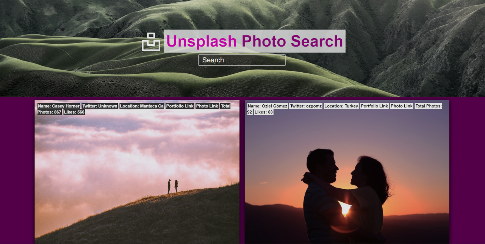

# 🧮 <span style="color:magenta">JS Unsplash Photo Search</span>


[](https://github.com/yilber/readme-boilerplate)
[](https://github.com/Yilber/readme-boilerplate/blob/master/LICENSE)
[](https://unsplash.com)


<!-- ## Background -->



> Super Simple JavaScript Photo Search using ease and superfast Unsplash API!

### 📚 STACK
- Html
- Css
- Javascript

## Installation

Open your terminal and type in

```sh
$ git clone https://github.com/sitowebveloce/javascript-unsplash-photo-search.git
$ cd java...
open index.html
```

## Scaffolding

```text
root
├── js
│   └── main.js
|   └── unk.js
├── css
│   └── main.css
├── imgs
│   └── logo.svg
│       
├── index.html
├── License
└── README.md
```

## How to use

* Clone the repo.
* Add your unsplash key in this file \js\unk.js
* Open index.html file.

## 🐛 Bugs

maybe...sure!

### Author

* [**Alex Paper**](https://www.sitowebveloce.it/) [](https://twitter.com/sitowebveloce)

### Support

Like what you see? Keep me awake at night by buying me a gradient.

<a href="https://buymeagradient.com/" target="_blank"></a>
<!-- <a href="https://www.patreon.com/bePatron?u=17267732" target="_blank"></a> -->
## License

2021 AlexPaper.

Usage is provided under the MIT License. See [LICENSE](https://github.com/Yilber/readme-boilerplate/blob/master/LICENSE) for the full details.
